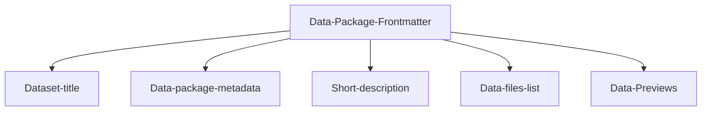

---
datapackage:
  title: Welcome to your template dataset page!
  description: This is a template for publishing your dataset with Datahub Cloud.
  created: 2024-01-01
  updated: 2024-01-31
  licenses:
  - path: http://opendatacommons.org/licenses/pddl/
    title: Open Data Commons Public Domain Dedication and License v1.0
  sources:
  - path: http://link.to/data/source
    title: Link to data source
  resources:
  - name: c02-per-decade
    title: C02 PPM per decade
    description: C02 PPM per decade
    lastModified: 2024-01-15
    path: data.csv
---

<div class="hero">
    <h1 class="hero-title">Exploring the Benefits of Regular Wheel Alignment for Your Vehicle<br/></h1>
    <p class="hero-description">Maintaining your vehicle&rsquo;s health is essential for ensuring a smooth and safe driving experience. One critical but often overlooked aspect of car maintenance is regular wheel alignment. This straightforward service can significantly impact your vehicle&rsquo;s performance, safety, and longevity. In this blog, we&rsquo;ll delve into the numerous benefits of regular wheel alignment and why it should be a priority in your vehicle maintenance routine.</p>

  1. Enhanced Driving Safety
   
  

<p>Proper wheel alignment ensures that your vehicle handles correctly, which is crucial for your safety. Misaligned wheels can cause your car to pull to one side, making it challenging to steer, especially in emergency situations. Regular alignment checks ensure that your wheels are parallel and that your tires meet the road at the correct angle, providing better control and stability.</p>

<h2>2. Improved Fuel Efficiency</h2>

<p>Did you know that misaligned wheels can reduce your vehicle&rsquo;s fuel efficiency? When wheels are out of alignment, your engine has to work harder to move the car forward, which increases fuel consumption. By keeping your wheels properly aligned, you can reduce rolling resistance and improve your car&rsquo;s fuel efficiency, saving you money at the pump.</p>

<h2>3. Extended Tire Lifespan</h2>


<p>Tires are a significant investment for any vehicle owner. Misaligned wheels can cause uneven tire wear, leading to premature tire replacement. Regular wheel alignment ensures that your tires wear evenly, extending their lifespan and saving you the cost of frequent replacements. This not only benefits your wallet but also reduces the environmental impact of tire disposal.</p>
<h2>4. Enhanced Driving Comfort</h2>


<p>Misaligned wheels can cause vibrations and an uncomfortable ride. You might notice your steering wheel vibrating or your car shaking at certain speeds. Proper wheel alignment ensures a smoother, more comfortable ride by reducing these unwanted vibrations and improving overall vehicle stability.</p>

<h2>5. Reduced Wear on Suspension and Steering Systems</h2>


<p>Your vehicle&rsquo;s suspension and steering systems are designed to work optimally with properly aligned wheels. Misalignment can place additional stress on these components, leading to accelerated wear and potential damage. Regular wheel alignment helps maintain the integrity of your suspension and steering systems, reducing the likelihood of costly repairs.</p>

<h2>6. Better Handling and Performance</h2>


<p>If you&rsquo;re a driving enthusiast, you know the importance of precise handling and optimal vehicle performance. Proper wheel alignment ensures that your tires have maximum contact with the road, enhancing grip and responsiveness. This can be particularly beneficial in challenging driving conditions, such as wet or icy roads.</p>

<h2>7. Prevention of Costly Repairs</h2>

<p>Regular wheel alignment can help identify and address potential issues before they become significant problems. By catching misalignment early, you can prevent more severe damage to your vehicle&rsquo;s tires, suspension, and steering systems. This proactive approach can save you from expensive repairs down the road.</p>

<h3>When to Check Your Wheel Alignment</h3>


<p>It&rsquo;s recommended to check your wheel alignment every 6,000 miles or as specified in your vehicle&rsquo;s owner&rsquo;s manual. Additionally, you should have your alignment checked if you notice any of the following signs:</p>

<p>&bull; Your vehicle pulls to one side.<br>&bull; Uneven tire wear.<br>&bull; Vibrations in the steering wheel.<br>&bull; The steering wheel is off-center when driving straight.<br>&bull; After hitting a curb or pothole.</p>

<h3>Conclusion</h3>

<p>Regular wheel alignment is a crucial aspect of vehicle maintenance that offers numerous benefits, from improved safety and fuel efficiency to extended tire lifespan and enhanced driving comfort. By making wheel alignment a regular part of your maintenance routine, you can enjoy a smoother, safer, and more cost-effective driving experience. Don&rsquo;t wait for signs of misalignment to appear &mdash; schedule your alignment check today and keep your vehicle running at its best.</p>
<p>Thanks for giving your valuable time to read this blog, In case you are having brand car for example Rolls Royce and you are looking for a <a href="https://servicemycar.com/uae/rolls-royce-repair-dubai">Rolls Royce Service</a> Dubai then visit Service My Car website in case you need any service or repairs.</p>
</div>


# Hello

![[Hello.png]]

*(Photo by Kassandra O'Shea on [flicker](http://www.flickr.com/photos/kyabean/8194627569/))*
 ·
## Overview

Here is a quick overview of the template you're looking at:

![[Overview.png]]

We have a frontmatter at the top, followed by the "body" of your site, which consists of unstructured data and/or data-rich components.

Feel free to customize the data package frontmatter accordingly when publishing your own data. 

> [!info]
> Frontmatter refers to the metadata placed at the beginning of the markdown file enclosed within triple dashes (---). This metadata provides essential information about the file and its content, enabling better organization, configuration, and processing by tools and platforms.



This is the frontmatter in this README.md:

```
---
datapackage:
  title: Welcome to your template dataset page!
  description: This is a template for publishing your dataset with Datahub Cloud.
  created: 2024-01-01
  updated: 2024-01-31
  licenses:
  - path: http://opendatacommons.org/licenses/pddl/
    title: Open Data Commons Public Domain Dedication and License v1.0
  sources:
  - path: http://link.to/data/source
    title: Link to data source
  resources:
  - name: c02-per-decade
    title: C02 PPM per decade
    description: C02 PPM per decade
    lastModified: 2024-01-15
    path: data.csv
---
```

You can either update it if you have some data files / datasets that you would want to publish or delete it completely if you have markdown content only (suitable for blogs, data stories, articles, etc.)

## Okay, I published the template. Now what?

You can add as many markdown files to your GitHub repository as you like, and you can freely nest them in subdirectories. You can also enhance your content with other data visualisation components and markdown features.

> Note: For a full list of supported markdown features visit [Markdown syntax support](https://datahub.io/@olayway/docs/Markdown%20syntax%20support)

Here are some quick examples:

> [!info] This is cool!
> Here's a callout block.
> It supports **markdown** and ```[[Internal link|wikilinks]]```.

Or you can quickly embed a piece of code as follows:

```
const ExampleCode = () => {
  return <div> .... </div>;
};
```

### How to take this template to the next level

> [!note]
> The template works best for datasets. If you don't have any data files, we suggest deleting the frontmatter and following this [quick tutorial on publishing data-rich stories](https://datahub.io/@olayway/docs/Publish%20data-rich%20stories)

You may also want to check out: 

<div class="middle-button-container">
    <a href="https://datahub.io/@olayway/docs/Customize%20Your%20DataHub%20Cloud%20Site%20with%20CSS" class="middle-button">Customize your site with CSS and HTML</a>
</div>

<div class="middle-button-container">
    <a href="https://datahub.io/@olayway/docs/Add%20visuals%20and%20data-rich%20components" class="middle-button">Add visuals and data-rich components</a>
</div>

<div class="middle-button-container">
    <a href="https://datahub.io/@olayway/docs/Add%20sidebar%20navigation" class="middle-button">Add sidebar navigation</a>
</div>

<div class="middle-button-container">
    <a href="https://datahub.io/@olayway/docs/Configuring%20Nav%20bar%20and%20SEO%20fields" class="middle-button">How to Configure Basic SEO Fields and Nav Bar</a>
</div>

> [!important]
> For any questions, refer to the [Docs](https://datahub.io/@olayway/docs)

> [!warning]
> Just testing some callout blocks here.

> [!done]
> Test passed.

## Testing data-rich components

I will add a data table from my data.csv file below:
<FlatUiTable
  data={{
    url: 'data.csv'
  }}
 />

 Looks kinda cool. What about a linechart? Let's see what this would look like:

 <LineChart
  data={{
    url: 'data.csv'
  }}
  title="C02 PPM per decade"
  xAxis="year"
  yAxis="co2"
/>

If you want to explore more of what's possible:

<div class="middle-button-container">
    <a href="https://datahub.io/@olayway/docs" class="middle-button">Go to the docs</a>
</div>

